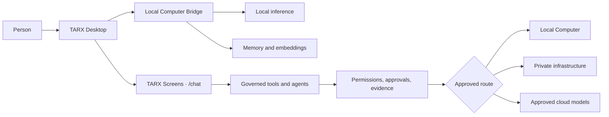

# TARX Desktop

### The desktop shell for governed, local-first AI

TARX Desktop connects people to a runtime where models, memory, tools,
permissions, approvals, and evidence work as one system.

**Computer by default. Supercomputer by permission.**

[Download](https://tarx.com/download) ·
[Releases](https://github.com/tarx-ai/tarx-desktop/releases) ·
[Security](SECURITY.md) ·
[System integrity](docs/SYSTEM_INTEGRITY.md) ·
[TARX CLI](https://github.com/tarx-ai/tarx-cli)

| | |
| --- | --- |
| **Company** | TARXAN Inc |
| **Status** | Public Mac beta |
| **OS** | macOS 14 Sonoma or later |
| **Architecture** | Apple Silicon (`arm64`) |
| **Release trust** | Developer ID signed, Apple notarized, and stapled |

Windows and Linux Desktop builds are not public.

## How it fits together



The Electron shell owns desktop lifecycle, navigation boundaries, local bridge
bootstrap, updates, and platform security. The loaded TARX product owns chat,
tool calls, and the agentic interaction surface.

## Install

1. Download the signed DMG from [tarx.com/download](https://tarx.com/download)
   or [GitHub Releases](https://github.com/tarx-ai/tarx-desktop/releases).
2. Open the DMG and drag **TARX** to Applications.
3. If Gatekeeper prompts, Control-click the app and choose **Open** once.
4. Optionally install the local runtime:

   ```sh
   curl -fsSL https://tarx.com/install | sh
   ```

### Verify a release

```sh
shasum -a 256 TARX-*-arm64.dmg
codesign --verify --deep --strict --verbose=2 /Applications/TARX.app
spctl --assess --type execute -v /Applications/TARX.app
xcrun stapler validate /Applications/TARX.app
```

A shipped, stapled release should report `accepted`,
`source=Notarized Developer ID`, and a successful stapler validation. Compare
the DMG checksum with the value published on its release.

## Public engineering proof

This repository exposes more than packaging:

- Hardened Electron runtime and macOS entitlements
- Signed, notarized, and stapled release workflow
- Navigation-boundary and agentic-chat smoke-test harnesses
- Local operator safety gates and runtime-spine readiness harnesses
- Voice capture, device, diagnostics, and evidence test surfaces
- System-integrity, incident, stability, and release documentation

Selected evidence:

- [System integrity](docs/SYSTEM_INTEGRITY.md)
- [Electron release stability](docs/TARX_ELECTRON_RELEASE_STABILITY.md)
- [Canonical runtime spine audit](docs/TARX_CANONICAL_RUNTIME_SPINE_AUDIT.md)
- [Security policy](SECURITY.md)
- [Release notes](docs/RELEASE_NOTES.md)

## Develop

Requires Node.js 20–22 and npm 10.

```sh
git clone https://github.com/tarx-ai/tarx-desktop.git
cd tarx-desktop
npm ci
npm run dev
```

Run the core public checks:

```sh
node scripts/qa-electron-navigation-boundary.js
node scripts/qa-desktop-agentic-chat-smoke.js
node scripts/qa-action-safety-gate.js
node scripts/qa-runtime-spine-readiness.js
```

## Public boundary

This repository makes the Desktop shell and its release/security evidence
inspectable. It does not publish TARX's proprietary cognitive engine,
orchestration control plane, internal operations tooling, customer data, model
weights, or production infrastructure.

Not claimed here:

- Production voice
- Public Windows or Linux Desktop builds
- Supercomputer enabled by default

## License

Proprietary — **UNLICENSED**. © TARXAN Inc. Source is visible for transparency;
redistribution requires written permission.

## Founder

TARX was founded by
[John Wantz Jr.](https://github.com/wantzjt), an AI systems architect and
product leader working on governed agents, private AI, enterprise search,
evaluation systems, and human-centered AI products.
